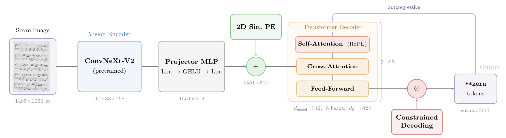
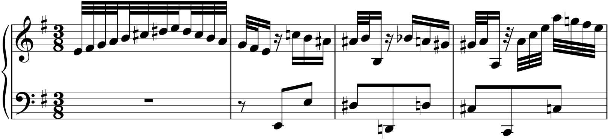
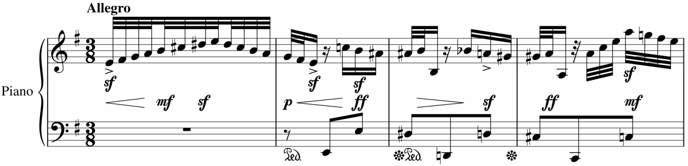
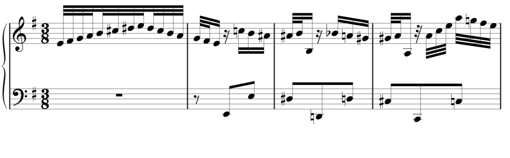
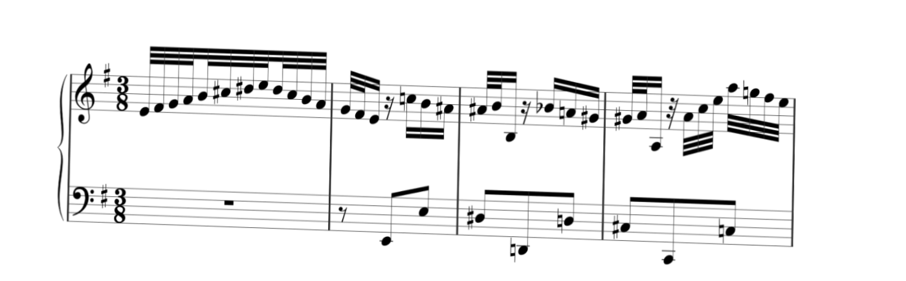
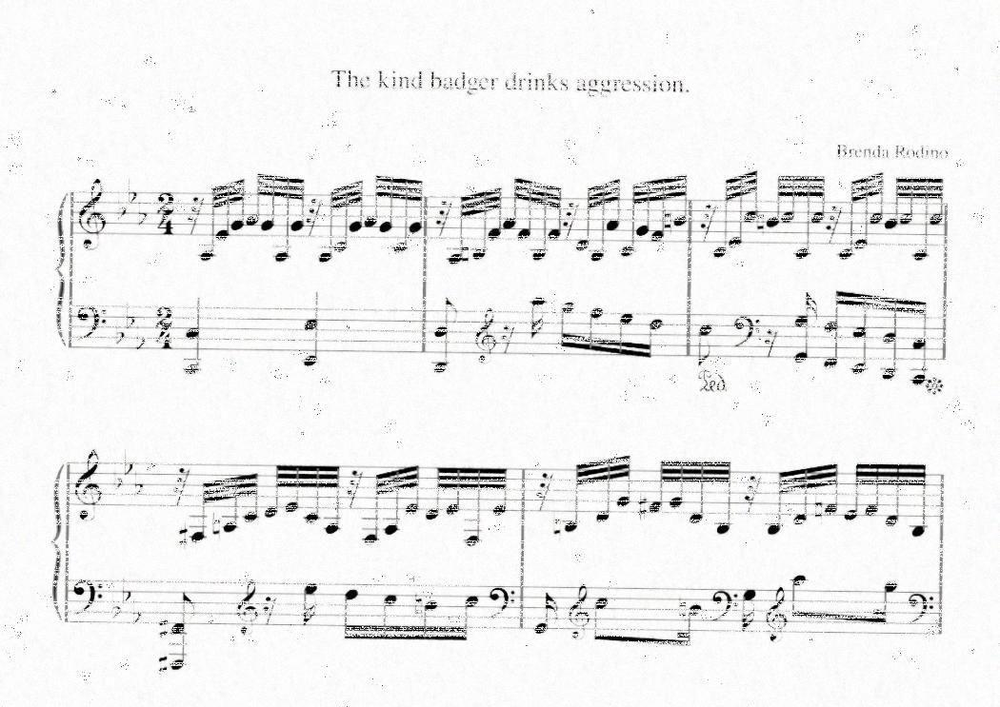
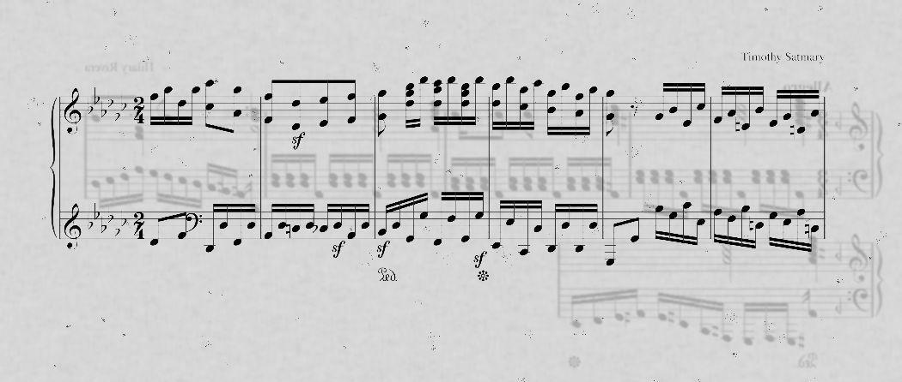
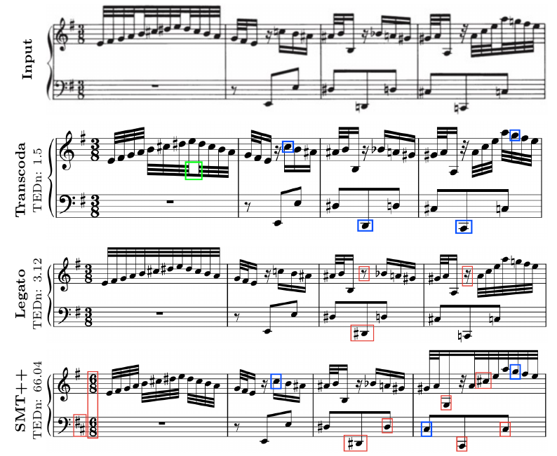

# Transcoda

**End-to-end zero-shot Optical Music Recognition via data-centric synthetic training.**

A compact 59M-parameter vision-encoder-decoder that turns raw score images directly into [`**kern`](https://www.humdrum.org/rep/kern/) symbolic transcriptions. Trained from scratch in about 5 hours on a single consumer GPU, on synthetic data only.

<p align="center">
  
</p>

## TL;DR

- **Compact and fast.** 59M parameters, 5h training on a single RTX 5090.
- **Data-centric.** A deterministic pipeline removes structural ambiguity from `**kern` targets so the decoder learns one canonical sequence per image.
- **Best score among compared systems** on a clean Verovio synthetic benchmark (18.22% OMR-NED) and on real-world Polish historical scans (76.03% OMR-NED), beating baselines that are an order of magnitude larger.
- **Optional constrained decoding** guarantees 100% formally valid `**kern` output for downstream renderers, at a small accuracy cost.
- Releases a standardized Verovio synthetic benchmark for future OMR evaluation.

## Headline results

OMR-NED (lower is better). Polish = 97 historical scanned scores; Verovio = 6,864 cleanly rendered synthetic scores.

| Model         |  Params | Polish (real) ↓ | Verovio (synthetic) ↓ |
| ------------- | ------: | --------------: | --------------------: |
| SMT++         |       — |          80.16% |                93.58% |
| Legato        |     1B+ |          86.73% |                43.91% |
| **Transcoda** | **59M** |      **76.03%** |            **18.22%** |

Transcoda uses unconstrained beam search (width 3) for these numbers. Switching to constrained decoding raises Polish OMR-NED to 80.27% but enforces strict structural validity.

## Method

**Architecture.** A pretrained ConvNeXt-V2 encodes a full-page score image into a 47×33 grid of 768-d patch features. A projector MLP and a 2D sinusoidal positional encoding lift these into a 1551×512 sequence. An 8-layer Transformer decoder with RoPE self-attention emits `**kern` tokens autoregressively over a 3,000-token vocabulary. End-to-end, no symbol detector, no staff segmenter.

**Target canonicalization is the key insight.** `**kern` lets the same score map to many syntactically different but semantically equivalent sequences. A deterministic pass collapses each score to one canonical form, so the decoder no longer has to model annotator style. The ablation is sharp:

| Configuration                          | OMR-NED ↓ |
| -------------------------------------- | --------: |
| Full Transcoda (canonicalized targets) |    18.56% |
| Same model, raw non-canonical targets  |    82.51% |

Removing canonicalization adds **+63.95** OMR-NED points on clean synthetic data. Capacity is not the bottleneck; target entropy is.

**Constrained decoding (optional).** A stateful, layered grammar engine enforces 2D `**kern` syntax and rhythmic mathematics during inference. It guarantees formally valid output for downstream parsers and renderers. On clean data it changes nothing. On heavily degraded scans it trades raw matching accuracy for a hard validity guarantee.

## Data pipeline

Training uses 361,938 synthetic examples. Two augmentation families decouple visual diversity from target ambiguity.

**Asymmetric semantic augmentation** adds dynamics, pedal markings, and tempo text to the _rendered image_ without changing the canonical `**kern` target. The model sees richer engraving without inheriting transcription noise.

<p align="center">
  
  
</p>

**Visual degradation** simulates print-and-scan reality: clean baseline, geometric warp, ink drop-out, and bleed-through.

<p align="center">
  
  
</p>
<p align="center">
  
  
</p>

## Qualitative example

Bach excerpt, identical input. Transcoda preserves rhythm and pitch; both baselines drift on long-range structure.

<p align="center">
  
</p>

TEDn against ground truth: **Transcoda 1.93**, Legato 3.12, SMT++ 66.04.

## Quick Start

### Prerequisites

- Python >= 3.11
- [uv](https://docs.astral.sh/uv/) package manager

### Installation

```bash
# Clone and install
git clone <repo-url> && cd Transcoda
uv sync

# Optional dependency groups
uv sync --group grammar   # xgrammar for constrained decoding
uv sync --group omr-ned   # semantic OMR evaluation metrics
uv sync --group dev       # development tools
```

### Inference

```bash
uv run scripts/inference.py \
    --weights ./weights/model.ckpt \
    --image path/to/score.png
```

Requires the `grammar` dependency group. Auto-detects CUDA/MPS/CPU.

## Training

```bash
source .venv/bin/activate

# Train from scratch
python train.py config/train.json

# Override config values via CLI (dot notation)
python train.py config/train.json --model.d_model=256 --training.max_epochs=10

# Resume from last checkpoint (enable auto_resume explicitly)
python train.py config/train.json --checkpoint.auto_resume=true

# Start fresh, ignoring existing checkpoints
python train.py config/train.json --fresh_run=true

# Validate a checkpoint without training
python train.py config/train.json --validate_only=true --checkpoint_path path/to/model.ckpt
```

See [`docs/TRAINING_AND_DATA.md`](docs/TRAINING_AND_DATA.md) for configuration details, Slurm
commands, FCMAE pretraining, dataset generation, profiling, and sequence trimming.

## Dataset Generation

The pipeline converts raw music scores through several stages into training-ready image-kern pairs.

### Stages

1. **Raw extraction** — pull source files (MusicXML, ekern)
2. **Kern conversion** — convert to `**kern` format
3. **Filtering** — drop structurally invalid kern files
4. **Normalization** — 21-pass canonicalization pipeline
5. **Manual fixes** — curated corrections (Polish scores)
6. **Rendering** — Verovio renders kern to SVG to PNG with augmentations
7. **Sequence-length filtering** — remove outliers

See [`docs/TRAINING_AND_DATA.md`](docs/TRAINING_AND_DATA.md) for dataset generation commands, run
artifacts, calibration notes, profiling, and sequence trimming.

See [`docs/normalization.md`](docs/normalization.md) for details on the normalization pipeline.

## Project Structure

```
src/
├── model/               # Vision-encoder-decoder architecture
├── training/            # Lightning module, optimizer setup
├── data/                # Datasets, collators, preprocessing
├── grammar/             # Grammar-constrained decoding (xgrammar)
├── core/                # Tokenizer utils, kern processing, metrics
├── evaluation/          # Evaluation harness, OMR-NED, wrappers
└── callbacks/           # W&B logging, progress tracking

scripts/
├── inference.py         # Single-image inference CLI
├── dataset_generation/  # Full data pipeline
└── benchmark/           # Evaluation & metric computation

grammars/kern.gbnf       # GBNF grammar for **kern notation
vocab/                   # BPE tokenizer (3k tokens)
config/                  # Training & fine-tuning configs
docs/                    # Architecture, normalization, constraint docs
```

## Documentation

- [Model Architecture](docs/MODEL_ARCHITECTURE.md) — encoder-decoder design, positional encoding, attention
- [Training and Data Operations](docs/TRAINING_AND_DATA.md) — Slurm commands, FCMAE pretraining, dataset generation, profiling, trimming
- [Normalization Pipeline](docs/normalization.md) — 21-pass kern canonicalization
- [Constrained Decoding](docs/constraint-decoding.md) — xgrammar integration and GBNF grammar
- [Configuration](config/README.md) — config structure, CLI overrides, per-section reference

## Paper

The full thesis is in [`paper.pdf`](./paper.pdf).

## Citation

```bibtex
@thesis{dratschuk2026transcoda,
  author = {Dratschuk, Daniel},
  title  = {Transcoda: End-to-End Zero-Shot Optical Music Recognition via Data-Centric Synthetic Training},
  school = {Heinrich-Heine-Universit{\"a}t D{\"u}sseldorf},
  type   = {Bachelor's thesis},
  year   = {2026},
}
```
